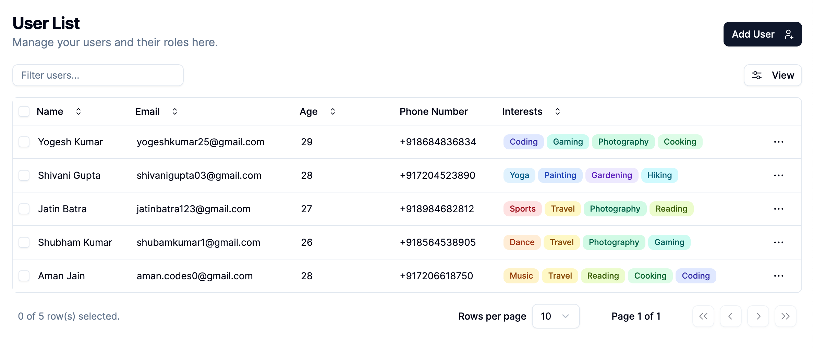
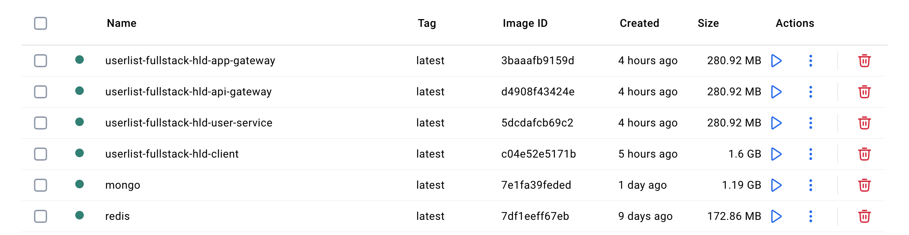
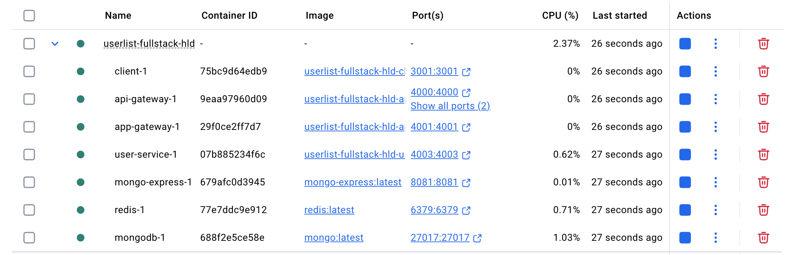
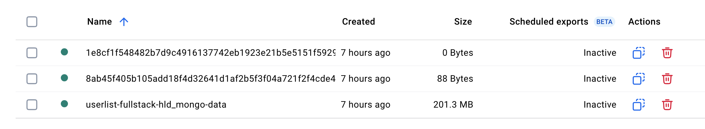
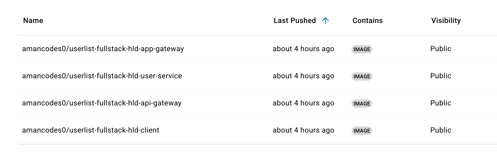
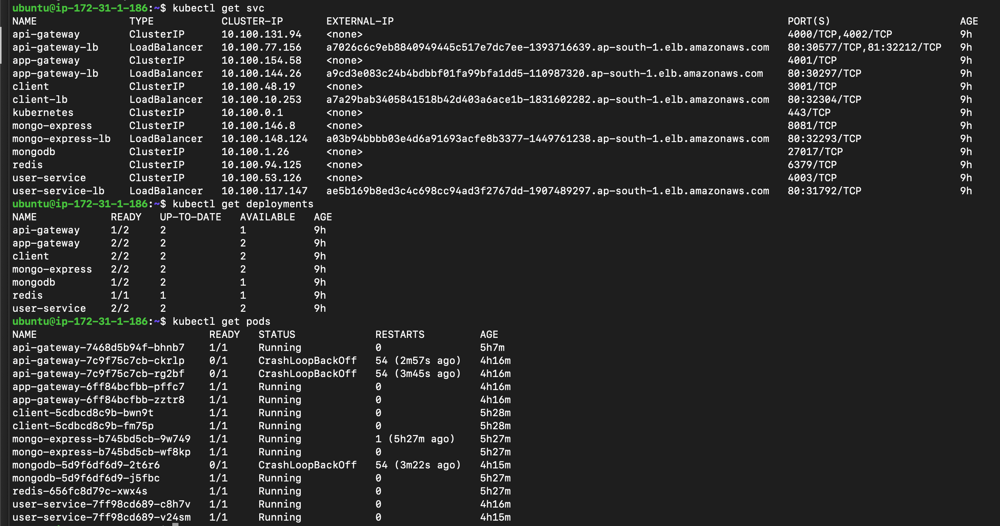

# User List Full Stack Application High Level Design

This is a Full Stack User List CRUD Application with a High Level Design Architecture where we can view, add, update, or delete a user.



## Project Infrastructure Overview

## 1. [Next.js](https://github.com/vercel/next.js) Frontend

🔗 **Live URL:** <http://a7a29bab3405841518b42d403a6ace1b-1831602282.ap-south-1.elb.amazonaws.com>

---

## 2. [NestJS](https://github.com/nestjs/nest) Backend

A [Hybrid Application](https://docs.nestjs.com/faq/hybrid-application) using [Microservices](https://docs.nestjs.com/microservices/basics):

- ### App Gateway (BFF - Backend for Frontend)

  🔗 **Live URL:** <http://a9cd3e083c24b4bdbbf01fa99bfa1dd5-110987320.ap-south-1.elb.amazonaws.com>

- ### API Gateway (Request Router to Microservices)

  🔗 **Live URL:** <http://a7026c6c9eb8840949445c517e7dc7ee-1393716639.ap-south-1.elb.amazonaws.com>

- ### User Microservice

  🔗 **Live URL:** <http://ae5b169b8ed3c4c698cc94ad3f2767dd-1907489297.ap-south-1.elb.amazonaws.com>

---

## 3. [MongoDB](https://github.com/mongodb/mongo) Database

🔗 **Live URL:** <http://a03b94bbbb03e4d6a91693acfe8b3377-1449761238.ap-south-1.elb.amazonaws.com>

---

## Advantages

1. Monorepo to streamline code organization
2. Microservice architecture handling a specific business logic
3. Dockerized Containers and Scalable to multiple [Kubernetes](https://kubernetes.io) Pods
4. Deployed Docker images of microservices on [Docker Hub](https://www.docker.com/products/docker-hub)
5. [Kubernetes Services, Load Balancing, and Networking](https://kubernetes.io/docs/concepts/services-networking)

## Deployment Using

1. [Docker](https://github.com/docker/getting-started)
2. [Kubernetes](https://github.com/kubernetes/kubernetes)
3. [Amazon Elastic Kubernetes Service](https://aws.amazon.com/eks)

## Prerequisites

1. [Install Node](https://nodejs.org/en/download)
2. [Install Git](https://git-scm.com/book/en/v2/Getting-Started-Installing-Git)
3. [Install Docker](https://docs.docker.com/engine/install)
4. [Install MongoDB](https://www.mongodb.com/docs/manual/installation)
5. [Install Redis](https://redis.io/docs/latest/operate/oss_and_stack/install/archive/install-redis)
6. [Install Kubernetes CLI (kubectl)](https://kubernetes.io/docs/tasks/tools/)

## Installation of the application

```bash
$ git clone https://github.com/aman-codes-1/userlist-fullstack-hld.git
$ cd userlist-fullstack-hld.git

#Frontend
$ cd packages/client
$ npm install
$ cd ../..

#Backend
$ cd packages/server
$ npm install
$ cd ../..
```

## Running the application using node server (the normal way)

```bash
# Backend in packages/server directory
# start: development
$ npm run start:dev
or
$ nest start --watch

# Debug/watch
$ npm run start:debug

# build: production
$ npm run build
or
$ nest build

# start: prod
$ npm run start:prod

# Frontend in packages/client directory
# development
$ npm run dev
or
$ next dev

# build: production
$ npm run build
or
$ next build

# start: production
$ npm start
or
$ next start
```

## Setting up the application for use with Docker & Docker Compose

```bash
# Build the images with docker-compose (all at once)
$ docker-compose build

# Run the images
$ docker-compose up -d

# or Build and run (all at once)
$ docker-compose up --build

# or Build the image (one by one)
$ docker build -t <IMAGE_NAME>:latest

# Run the image interactively
$ docker run -it -p 3000:3000 <IMAGE_NAME>:latest

# Push image to docker hub
$ docker login
$ docker tag <IMAGE_NAME>:latest <DOCKER_HUB_USER_NAME>/<IMAGE_NAME>:latest
$ docker push <DOCKER_HUB_USER_NAME>/<IMAGE_NAME>

# Get the container ID
$ docker ps

# View logs
$ docker logs <CONTAINER_ID>

# Enter the container (In alpine, use sh because bash is not installed by default)
$ docker exec -it <CONTAINER_ID> /bin/sh
```

## Docker Files

[docker-compose.yaml](docker-compose.yaml)
[Client dockerfile](packages/client/dockerfile)
[Server dockerfile](packages/server/dockerfile)

## Docker Images



## Docker Containers



## Docker Volumes



## Pushed Docker Images on Docker Hub



### 🚀 User List Full Stack HLD Docker Images

- **Client**
  
  *amancodes0/userlist-fullstack-hld-client*

  <https://hub.docker.com/r/amancodes0/userlist-fullstack-hld-client>

- **App Gateway**
  
  *amancodes0/userlist-fullstack-hld-app-gateway*

  <https://hub.docker.com/r/amancodes0/userlist-fullstack-hld-app-gateway>

- **API Gateway**
  
  *amancodes0/userlist-fullstack-hld-api-gateway*

  <https://hub.docker.com/r/amancodes0/userlist-fullstack-hld-api-gateway>

- **User Service**
  
  *amancodes0/userlist-fullstack-hld-user-service*

  <https://hub.docker.com/r/amancodes0/userlist-fullstack-hld-user-service>

---

## Kubernetes Manifest Files (.yaml)

*App Gateway Deployment:* [app-gateway-deployment.yaml](k8s/app-gateway-deployment.yaml)

*App Gateway Service:* [app-gateway-service.yaml](k8s/app-gateway-service.yaml)

*App Gateway Load Balancer:* [app-gateway-loadbalancer.yaml](k8s/app-gateway-loadbalancer.yaml)

*Api Gateway Deployment:* [api-gateway-deployment.yaml](k8s/api-gateway-deployment.yaml)

*Api Gateway Service:* [api-gateway-service.yaml](k8s/api-gateway-service.yaml)

*App Gateway Load Balancer:* [api-gateway-loadbalancer.yaml](k8s/api-gateway-loadbalancer.yaml)

*User Service Deployment:* [user-service-deployment.yaml](k8s/user-service-deployment.yaml)

*User Service Service:* [user-service-service.yaml](k8s/user-service-service.yaml)

*User Service Load Balancer:* [user-service-loadbalancer.yaml](k8s/user-service-loadbalancer.yaml)

*Client Deployment:* [client-deployment.yaml](k8s/client-deployment.yaml)

*Client Service:* [client-service.yaml](k8s/client-service.yaml)

*Client Load Balancer:* [client-loadbalancer.yaml](k8s/client-loadbalancer.yaml)

*MongoDB Deployment:* [mongodb-deployment.yaml](k8s/mongodb-deployment.yaml)

*MongoDB Service:* [mongodb-service.yaml](k8s/mongodb-service.yaml)

*Mongo Express Deployment:* [mongo-express-deployment.yaml](k8s/mongo-express-deployment.yaml)

*Mongo Express Service:* [mongo-express-service.yaml](k8s/mongo-express-service.yaml)

*Mongo Express Load Balancer:* [mongo-express-loadbalancer.yaml](k8s/mongo-express-loadbalancer.yaml)

*Mongo Data PVC:* [mongo-data-persistentvolumeclaim.yaml](k8s/mongo-data-persistentvolumeclaim.yaml)

*Redis Deployment:* [redis-deployment.yaml](k8s/redis-deployment.yaml)

*Redis Service:* [redis-service.yaml](k8s/redis-service.yaml)

## kubectl commands

```bash
# Create or apply changes to resources
$ kubectl apply -f app-gateway-deployment.yaml

# Get all services
kubectl get svc

# Get all deployments
kubectl get deployments

# Restart deployment
kubectl rollout restart deployment <DEPLOYMENT_NAME>

# Get all pods
kubectl get pods

# Get logs of pod
kubectl logs <pod-name>

# Stream the logs of pod
kubectl logs -f <pod-name>

# Delete all deployments
kubectl delete deployments --all

# Delete all pods
kubectl delete pods --all

# Delete all resources
kubectl delete all --all
```

## AWS EKS (Elastic Kubernetes Service) Deployments, Services, and Pods


